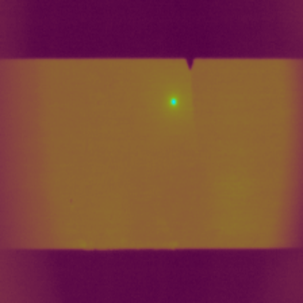

# FLYD
Provides access to FLYing-spot laser thermography dataset and its instances. This work was presented in the Quality Control by Artificial Vision (QCAV 2023) conference, under the title "Laser flying-spot thermography: an open-access dataset for machine learning and deep learning". The dataset consists in reconstructed thermal images from the recordings of laser thermography examinations: the thermal scans are performed parallel to the crack, in order to follow the crack length on the material surface. Parts examined are several fatigue test specimens with various crack opening and length. More details about the registration from thermal movies to thermal images/maps, examination settings... are given in the QCAV 2023 proceeding, available soon.

- FLYD-C: binary classification task dataset, between crack and healthy images. The actual dataset contains 891 thermal images for training, and 286 for the test-set. Each subset was produced from differentiated fatigue test samples. The dataset is compressed in the zip archive "FLYD-C.zip".
- FLYD-D instance: in construction (detection task) 
- FLYD-S instance: in construction (segmentation task)

<!-- Align images to the center -->
<figure>
<p align="center">
  
  
  
</p>
<figcaption style="text-align: center; font-style: italic;"> <p> <i> Figure: examples of thermal recording. All the thermal recordings are converted into reconstructed thermal images by summing and normalizing all the frames of a scan, in a selected region of interest. The frames are also registered in the examined part referential. </i> </p> </figcaption>
</figure>

# Road-Map :construction:
-  We firstly add the original dataset for classification, FLYD-C. A training code is also given. Some thermal images have a poorer image quality, due to some thermal camera issues: several images present a small blurring effect. An updated version of the dataset with better registration quality will arrive later, introducing also more challenging samples with high reflection surfaces. 
-  The addition of the localization dataset is planned for a later time. The annotations will be given in MS-COCO 2017 format. 
-  We are still working on subsampling the original thermal recordings, which are relatively massive in order to provide access to them.
-  A few thermal scans following the forward-backward conventional procedure, crossing the defect, will arrive too.

# Benchmarking some architectures (classification task) 
Results correspond to the score presented during the QCAV 2023 conference. A large panel of architectures have been tested (both convolution and attention based architectures). The different metrics are evaluated on the test-set. Architectures were trained with the same hyperparameters for this work, but you should increase performance of a given architecture by adjusting its hyperparameters. 

- Convolution-based architectures:

| Model           | Initialization | Accuracy |  F1-Score | Precision | Recall |
|-----------------|----------------|----------|-----------|-----------|--------|
| VGG13           | Random         | 0.839    | 0.840     | 0.910     | 0.781  |
|                 | Pre-trained    | 0.902    | 0.902     | 0.985     | 0.832  |
| VGG16           | Random         | 0.755    | 0.713     | 0.977     | 0.561  |
|                 | Pre-trained    | 0.811    | 0.795     | 0.977     | 0.677  |
| ConvNext        | Random         | -        | -         | -         | -      |
|                 | Pre-trained    | 0.989    | 0.990     | 0.981     | 0.999  |


- Attention-based architectures: 

| Model           | Initialization | Accuracy |  F1-Score | Precision | Recall |
|-----------------|----------------|----------|-----------|-----------|--------|
| ViT-B           | Random         | 0.867    | 0.881     | 0.850     | 0.916  |
|                 | Pre-trained    | 0.986    | 0.987     | 0.975     | 0.999  |
| ViT-L           | Random         | 0.843    | 0.862     | 0.819     | 0.910  |
|                 | Pre-trained    | 0.990    | 0.990     | 0.981     | 1.00   |
| Swin            | Random         | -        | -         | -         | -      |
|                 | Pre-trained    | 0.989     | 0.990    | 0.987     | 0.993  |
| CaiT            | Random         | -        | -         | -         | -      |
|                 | Pre-trained    | 0.989     | 0.990    | 0.981     | 0.999  |

# Train a classifier with the proposed code :rocket:	
Requirements: pytorch, scikit-learn, timm library (pytorch image model) (latest versions install through conda or pip should work).
You can directly download this github repository and launch the python script <strong> train_classifier.py </strong> on the command line, with specific arguments. You should decompress the archive containing the dataset (FLYD-C) into this main directory in order to run the provided code.

Here's a brief explanation of the command-line arguments:
- --training_rep: Path to the training dataset.
- --test_rep: Path to the test dataset.
- --model: Name of the timm model to use (default: vgg13)
- --pretrained: load a pretrained model (better performance, thanks to transfer learning) or not (less performance and/or longer training duration). (default: True)  
- --num_epochs: Number of epochs to train the model. (default: 10, adapted for a pre-trained model) 
- --batch_size: Number of input images feeding the model at each iteration, during one epoch. You can increase it, depending on your hardware specifications. (default: 16) 
- --learning_rate: Learning rate for the optimizer (default: 1e-4).
- --output_dir: Path to the directory to save the log and model state dict (default: None).
  
You can customize the script by changing the values of the command-line arguments as needed. More details about the training (augmentations, metrics evaluated...) are given in the proceeding from the conference. 

## Cite
If the dataset is used for academic purpose, please consider citing our work: 

```
@inproceedings{FLYD-QCAV2023,
  title        = {{Laser flying-spot thermography: an open-access dataset for machine learning and deep learning}},
  author       = {Helvig, Kevin and Trouv{\'e}-Peloux, Pauline and Gav{\'e}rina, Ludovic and Roche, Jean-Michel and Abeloos, Baptiste and Pradere, Christophe},
  year         = {2023},
  month        = jun,
  adress       = {Albi, France},
  booktitle    = {{Sixteenth International Conference on Quality Control by Artificial Vision}},
  publisher    = {SPIE},
}
```
